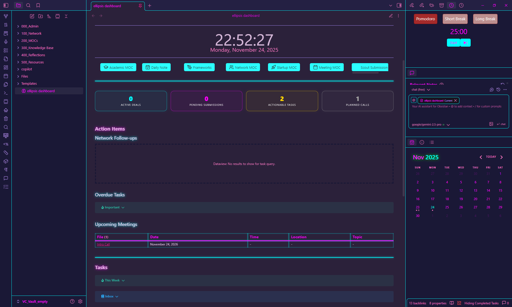
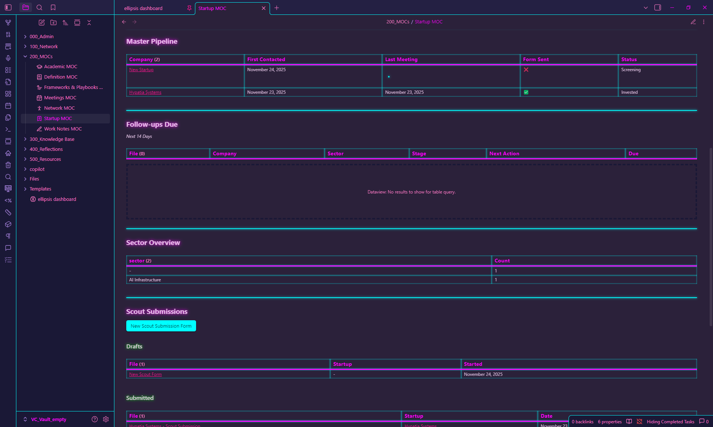
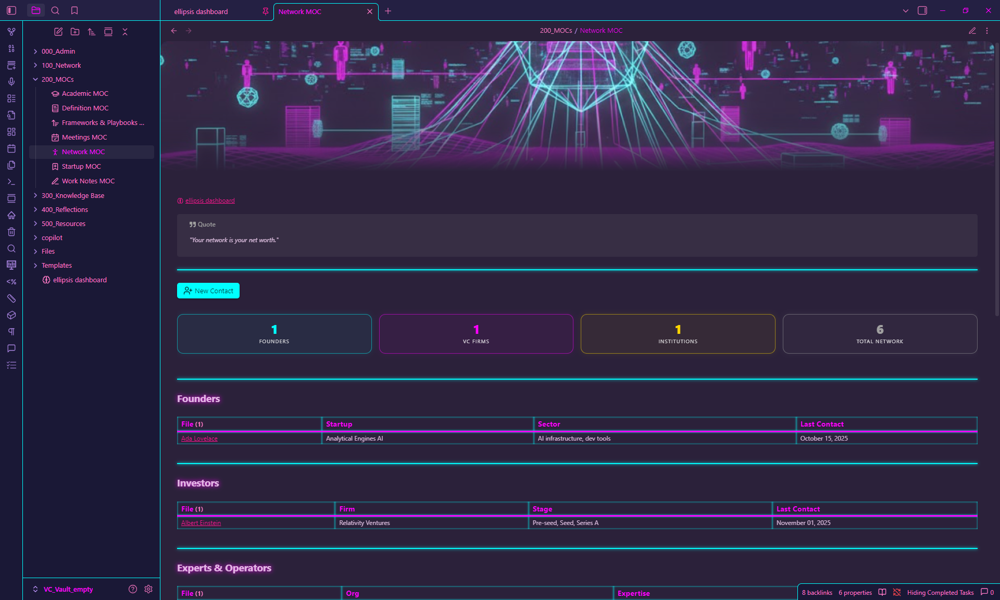
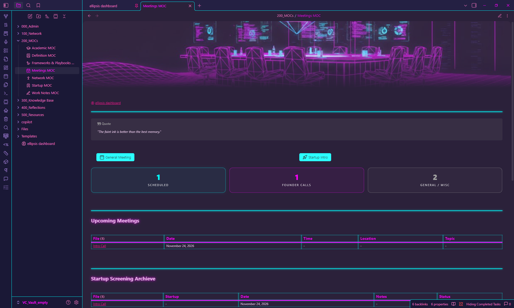
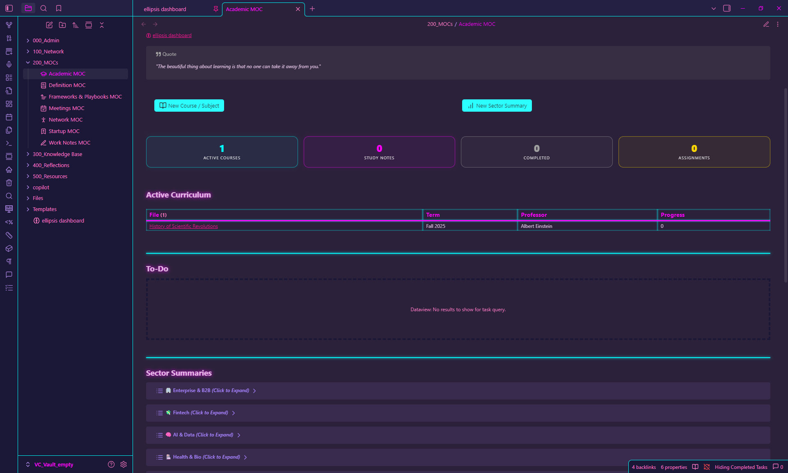
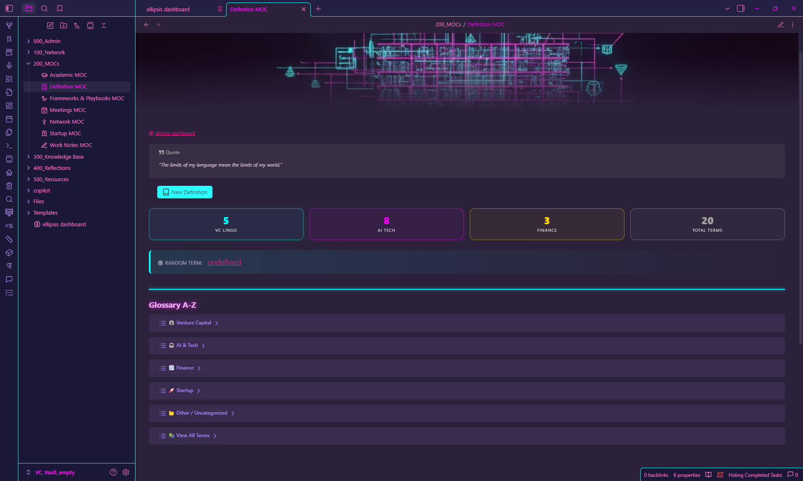
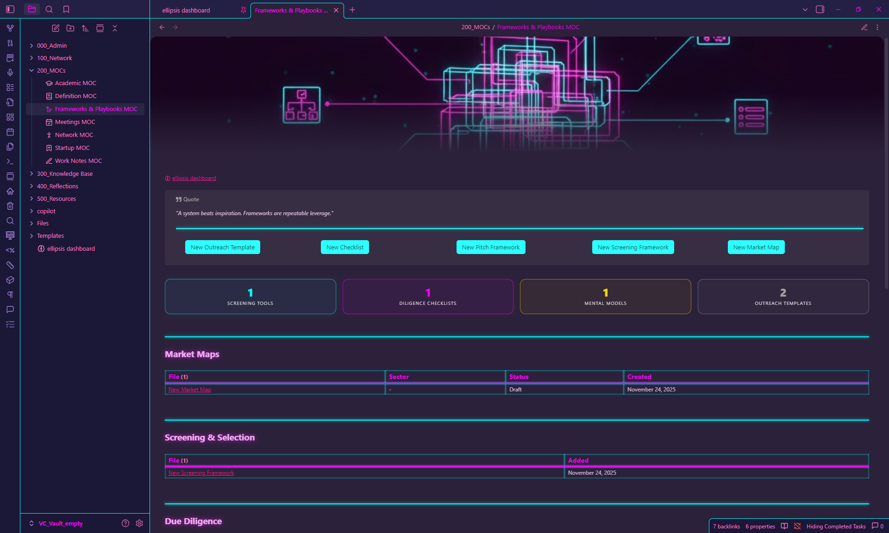
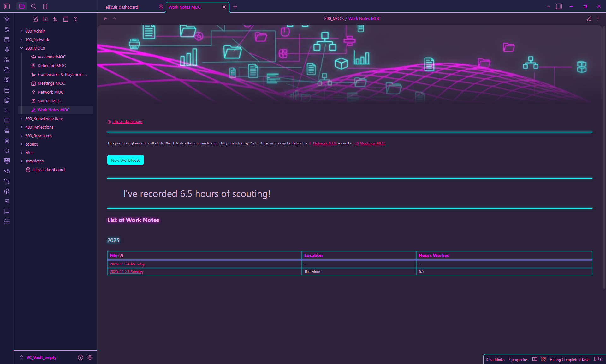

# 🚀 VC Scout Vault

Welcome to the **VC Scout Vault**.  
This is an Obsidian vault template for scouts who want a **structured, data driven system** for managing deal flow, networks, and knowledge.

It is the VC equivalent of a lab notebook. It is meant to be used every day to think, log, and connect information.

---
## 📸 What's Inside?

<p align="center">
  
</p>

## 1. Vault Structure

### Core Principles

1. **Pipeline driven**  
   All **MOCs** (Maps of Content) act as dashboards that pull live data from your notes. For example Active Deals, Upcoming Meetings, Tasks Due.

2. **Data first. Templates as forms**  
   When you create a `Startup`, `Meeting`, `Contact`, or `Scout Submission`, you use a template that captures standard fields such as `deal_status`, `round_type`, `submission_status`. These fields power the dashboards.

3. **Cross referencing over folders**  
   Folders keep things tidy. Real structure comes from links.  
   Notes are connected with `[[Wikilinks]]`, tags, and frontmatter, not by deep folder hierarchies.

### Folder Map

| Folder Path              | Purpose                                                          | Key MOC(s)                          |
|--------------------------|------------------------------------------------------------------|-------------------------------------|
| `100_Network`           | Active deal flow. Startups, Contacts, Firms, Meetings, Submissions. | `[[Startup MOC]]`, `[[Network MOC]]` |
| `200_MOCs`             | Contains all the MOCs. | N/A                                 |
| `300_Knowledge Base`    | Learning and reference. Academic courses, sector summaries, definitions. | `[[Academic MOC]]`, `[[Definition MOC]]` |
| `400_Reflections`             | All personal, random notes. | N/A                                 |
| `500_Resources`             | If you connect Zotero, your research notes will be parsed into the 'Research' folder. Same if you use the PodNotes plugin for the 'Podcasts' folder. | N/A                                 |
| `000_Admin`             | Internal documents, frameworks, and repeatable processes.        | `[[Frameworks & Playbooks MOC]]`    |
| `Templates`             | All note templates. Startup, Meeting, Scout Submission, Zotero, etc. | N/A                                 |
| `Files`             | Any images added to a note are automatically organised into 'Attachments'. 'Banners' is for the style of each page. 'JS' contains Javascript. | N/A                                 |

## 🗺️ Map of Content Previews

<p align="center">
  
  
  
</p>

<p align="center">
  
  
  
</p>

<p align="center">
  
</p>

---

## 2. Key Workflows

### A. Daily Focus

1. Set **`[[ellipsis dashboard]]`** 
2. Each morning.
   - Review **Actionable Tasks**. tasks due in the next 7 days  
   - Check **Active Deals** and **Pending Submissions**.
3. Use the quick launch buttons at the top to.
   - Create a new startup  
   - Log a meeting  
   - Open the scout submission form

### B. Scout Pipeline. From startup to submission

1. **Create a startup record**  
   Open `[[Startup MOC]]` and use the **New Startup** button. Fill in round, sector, location, and links.

2. **Log interaction**  
   Open `[[Meetings MOC]]` and use the appropriate meeting template (e.g. “Startup Intro”).  
   Inside the meeting note, link:
   - `[[Startup Name]]`  
   - `[[Founder Name]]` or existing contacts

3. **Draft a scout submission**  
   From the startup note, trigger **Draft Scout Submission**.  
   This creates a `Scout Submissions/...` note pre linked to the startup.

4. **Track follow ups with Tasks**  
   Add tasks directly inside meeting or startup notes, for example.  
   ```markdown
   - [ ] Email about intro [due:: 2025-12-05] #followup

> The dashboard will automatically show upcoming tasks and planned calls if the Tasks plugin is active.

## 3. Plugin Setup (Critical)

The vault relies on several community plugins. If these are not installed and enabled, many dashboards and buttons will break or show errors.

For a more detailed walk through, see _setup_guide.md_ inside the vault.

### Core Plugins

| Plugin                 | Role in the vault                                                     |
|------------------------|-----------------------------------------------------------------------|
| Dataview               | Runs all dynamic tables and dashboards.                              |
| Templater              | Fills dates, file names, and template variables.                      |
| Meta Bind              | Powers interactive buttons and inline inputs.                         |
| Tasks                  | Handles `[ ]` tasks with due dates and queries.                       |
| Admonition             | Provides the colored callout boxes and layouts.                       |
| Banners                | Shows header images on dashboards and MOCs.                           |
| Calendar               | Optional calendar sidebar and daily note hooks.                       |
| Callout Manager        | Helps manage custom callouts like `[!col]`.                           |
| Completed Task Display | Optional. For visualising completed tasks.                            |
| Homepage               | Lets you set ellipsis dashboard as Obsidian home.                     |
| Iconize                | Adds icons to buttons and links.                                      |
| Natural Language Dates | Allows `due:: tomorrow`, `next Monday`, etc.                          |
| Zotero Integration     | Imports papers, highlights, and metadata.                             |

### Quick Install Checklist

1. In Obsidian, go to `Settings → Community plugins`.
2. Turn **Restricted mode** off.
3. Click **Browse**, search each plugin above, and install.
4. Make sure the toggles for these plugins are **ON** in the Community plugins list.

---

## 4. Critical Configuration

### A. Templater

- **Settings → Templater**
  - **Template folder location**: `Templates`
  - **Default date format**: `YYYY-MM-DD`  
    _(or align with your daily note naming convention)_

### B. Zotero Integration

If you use Zotero:

- **Settings → Zotero Integration**
  - **Template file**: `Templates/Zotero Template.md`
  - **Output path**: `500_Resources/Research/Paper Notes`
  - **Image output path**: `500_Resources/Research/Paper Notes/Images`

### C. Meta Bind

- **Settings → Meta Bind**
  - **Output format**: `Inline` or `Adaptive`  
    _(either is fine for this vault)_

---

## 5. Theme and Visual Style

To get the same look as the screenshots:

- **Theme**: `80s Neon` (community theme)
- **CSS snippets**: Enable at least the following:
  - `dashboard.css`
  - `MCL Gallery Cards.css`
  - `MCL Multicolumn.css`
  - `image_align_right.css`
  - `tabbed.css`
  - `tame-buttons.css`
  - _Any other snippets included with the vault that you like_

### Steps

1. `Settings → Appearance → Themes`: select `80s Neon`.
2. `Settings → Appearance → CSS snippets`: toggle the snippets above to **ON**.

> If you prefer another theme, the functional parts will still work. Only the visuals will change.

---

## 6. Getting Started Summary

1. Clone the repo with GitHub Desktop or `git clone`.
2. Open the cloned folder as a vault in Obsidian.
3. Install and enable the plugins listed above.
4. Enable the `80s Neon` theme and CSS snippets.
5. Open `[[ellipsis dashboard]]`.

> If you see metrics, buttons, and tables without errors, you are ready to scout.

---

## 7. License

This template is provided under the **MIT License**.  
See the `LICENSE` file in this repository for details.

---

## 8. Contributing

Suggestions are welcome.

- For **small changes**, open an issue or send a pull request.
- For **larger changes** to structure or workflows, open an issue first with a short proposal so we can align on patterns.

> The goal is to keep this vault a clean, opinionated, but flexible system for scouts who want a serious knowledge base instead of scattered notes.
